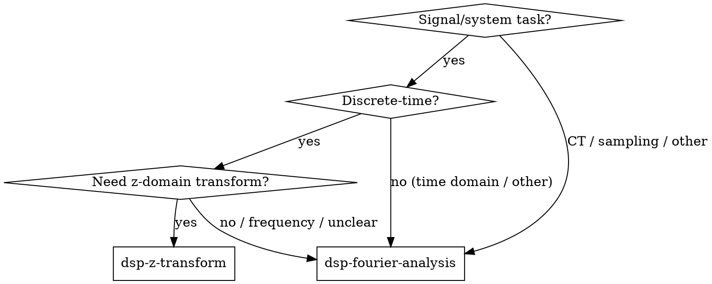

# DSP Skills Family Implementation Plan

> **For agentic workers:** REQUIRED SUB-SKILL: Use superpowers:subagent-driven-development (recommended) or superpowers:executing-plans to implement this plan task-by-task. Steps use checkbox (`- [ ]`) syntax for tracking.

**Goal:** Build and test the first three skills of the DSP family: the router `dsp-problem-solving` plus sub-skills `dsp-fourier-analysis` and `dsp-z-transform`.

**Architecture:** A main router skill classifies signal/system problems and dispatches to focused sub-skills. Each skill is a self-contained `SKILL.md` with YAML frontmatter, a decision flowchart, a core pattern, quick-reference tables, and red flags. Source skill files live in the project under `skills/dsp/` and are deployed to `~/.agents/skills/dsp/` for runtime loading.

**Tech Stack:** Markdown skill files; subagent pressure scenarios for validation; Oppenheim markdown as reference source.

## Global Constraints
- All skill names use lowercase letters, numbers, and hyphens only.
- All skill descriptions start with "Use when..." and describe triggering conditions, not workflow.
- Each skill file stays under 500 words where possible.
- Skills must be self-contained; the 39k-line Oppenheim markdown is only for deep lookup.
- No skill is deployed until it passes its pressure scenarios.

---

### Task 1: Create directory structure and project-local skill source tree

**Files:**
- Create: `skills/dsp/dsp-problem-solving/`
- Create: `skills/dsp/dsp-fourier-analysis/`
- Create: `skills/dsp/dsp-z-transform/`

**Interfaces:**
- Produces: Three empty skill source directories in the project.

- [ ] **Step 1: Create project skill directories**

```bash
mkdir -p skills/dsp/dsp-problem-solving
mkdir -p skills/dsp/dsp-fourier-analysis
mkdir -p skills/dsp/dsp-z-transform
```

- [ ] **Step 2: Verify directories exist**

```bash
ls -la skills/dsp/
```

Expected: Three `dsp-*` directories listed.

- [ ] **Step 3: Commit**

```bash
git add skills/dsp/
git commit -m "chore: scaffold dsp skill source tree"
```

---

### Task 2: Write pressure scenarios for the router skill

**Files:**
- Create: `skills/dsp/dsp-problem-solving/scenarios.md`

**Interfaces:**
- Produces: Baseline test scenarios used in Tasks 3 and 4.

- [ ] **Step 1: Write the scenario file**

Create `skills/dsp/dsp-problem-solving/scenarios.md`:

```markdown
# Router Skill Pressure Scenarios

## Scenario A: Discrete-time filter problem
**Prompt:** "I have a difference equation y[n] - 0.5y[n-1] = x[n]. I need the system function, the impulse response, and to check stability."
**Expected behavior without skill:** Agent may jump straight to z-transform but skip ROC analysis or confuse with Laplace.
**Expected behavior with skill:** Agent loads `dsp-z-transform`, writes H(z), identifies ROC |z| > 0.5, computes inverse transform, declares stable (pole inside unit circle).

## Scenario B: Continuous-time Fourier problem
**Prompt:** "Find the Fourier transform of e^{-at}u(t), a > 0, and use it to find the output of an LTI system with this input."
**Expected behavior without skill:** Agent may guess the transform pair wrong or omit convergence condition.
**Expected behavior with skill:** Agent loads `dsp-fourier-analysis`, states X(jω) = 1/(a + jω), notes convergence requires a > 0, then applies convolution theorem.

## Scenario C: Ambiguous mixed-domain prompt
**Prompt:** "I sampled a continuous cosine at 8 kHz and the reconstructed signal sounds wrong."
**Expected behavior without skill:** Agent may identify aliasing through the Nyquist criterion without loading a structured skill.
**Expected behavior with skill:** Agent loads `dsp-fourier-analysis` (the fallback for unimplemented `dsp-sampling`) and diagnoses aliasing using the Nyquist criterion.
```

- [ ] **Step 2: Verify file was created**

```bash
ls -la skills/dsp/dsp-problem-solving/scenarios.md
```

- [ ] **Step 3: Commit**

```bash
git add skills/dsp/dsp-problem-solving/scenarios.md
git commit -m "test: add router skill pressure scenarios"
```

---

### Task 3: Baseline router skill behavior without guidance

**Files:**
- Read: `skills/dsp/dsp-problem-solving/scenarios.md`

**Interfaces:**
- Consumes: Scenarios from Task 2.
- Produces: Documented baseline behavior and rationalizations.

- [ ] **Step 1: Run each scenario through a subagent with no DSP skill loaded**

Use `Agent` with `subagent_type: "coder"` and a system prompt that does NOT include any DSP skill. Pass each scenario prompt as the user task.

Example subagent prompt:

```
You are a helpful coding assistant. Do not load any DSP skill. The user asks:
"I have a difference equation y[n] - 0.5y[n-1] = x[n]. I need the system function, the impulse response, and to check stability."
Solve the problem and explain your reasoning.
```

- [ ] **Step 2: Record baseline failures verbatim**

Append to `skills/dsp/dsp-problem-solving/scenarios.md` under each scenario:

```markdown
**Baseline observations:**
- [agent output summary]
- [rationalizations]
```

- [ ] **Step 3: Commit**

```bash
git add skills/dsp/dsp-problem-solving/scenarios.md
git commit -m "test: record router skill baseline behavior"
```

---

### Task 4: Implement the router skill

**Files:**
- Create: `skills/dsp/dsp-problem-solving/SKILL.md`

**Interfaces:**
- Consumes: Baseline failures from Task 3.
- Produces: Router skill that dispatches to sub-skills.

- [ ] **Step 1: Write the router skill**

Create `skills/dsp/dsp-problem-solving/SKILL.md`:

```markdown
---
name: dsp-problem-solving
description: Use when analyzing or implementing signals and systems code and need to choose a DSP method or transform.
---

# DSP Problem Solving

## Overview
Classify the signal/system task and load the focused sub-skill that teaches the right technique.

## When to Use
- The task involves continuous-time or discrete-time signals or LTI systems.
- You need to choose between time-domain, Fourier, Laplace, or z-domain analysis.
- You are reviewing or writing DSP code and want to avoid transform misuse.

## Decision Flowchart



## Routing Rules

1. If the system/signal is discrete-time and you need the z-transform (difference equation, H(z), ROC, stability) → load `dsp-z-transform`.
2. For all other signal/system tasks — including continuous-time transforms, Fourier analysis, sampling, Laplace, time-domain-only analysis, or unclear/mixed CT-DT problems — load `dsp-fourier-analysis`.

## Available Sub-Skills (This Cycle)

The following sub-skills are implemented and ready to load:
- `dsp-fourier-analysis`
- `dsp-z-transform`

The following sub-skills are planned for future cycles:
- `dsp-continuous-time-lti`
- `dsp-discrete-time-lti`
- `dsp-laplace-transform`
- `dsp-sampling`

## Common Mistakes
- Picking Laplace for a discrete-time problem or z-transform for a continuous-time problem.
- Skipping the region of convergence / stability check.
- Trying to solve a sampling problem entirely in one domain without checking the Nyquist condition.
```

- [ ] **Step 2: Verify YAML frontmatter and file presence**

```bash
head -5 skills/dsp/dsp-problem-solving/SKILL.md
ls -la skills/dsp/dsp-problem-solving/SKILL.md
```

- [ ] **Step 3: Commit**

```bash
git add skills/dsp/dsp-problem-solving/SKILL.md
git commit -m "feat: add dsp-problem-solving router skill"
```

---

### Task 5: Verify router skill with pressure scenarios

**Files:**
- Read: `skills/dsp/dsp-problem-solving/SKILL.md`
- Read: `skills/dsp/dsp-problem-solving/scenarios.md`

**Interfaces:**
- Consumes: Router skill from Task 4; scenarios from Task 2.
- Produces: Updated scenario file with verification results.

- [ ] **Step 1: Re-run each scenario through a subagent with the router skill loaded**

Use `Agent` with `subagent_type: "coder"` and a system prompt that includes the router skill content. The subagent should state which sub-skill it would load next and why.

- [ ] **Step 2: Record compliance or failures**

Append to `skills/dsp/dsp-problem-solving/scenarios.md`:

```markdown
**With-skill observations:**
- [agent output summary]
- [compliance or failure]
```

- [ ] **Step 3: If failures remain, patch the skill and re-test**

Edit `skills/dsp/dsp-problem-solving/SKILL.md` to close loopholes, then repeat Step 1.

- [ ] **Step 4: Commit**

```bash
git add skills/dsp/dsp-problem-solving/
git commit -m "test: verify router skill against pressure scenarios"
```

---

### Task 6: Write pressure scenarios for `dsp-fourier-analysis`

**Files:**
- Create: `skills/dsp/dsp-fourier-analysis/scenarios.md`

**Interfaces:**
- Produces: Baseline test scenarios for the Fourier sub-skill.

- [ ] **Step 1: Write the scenario file**

Create `skills/dsp/dsp-fourier-analysis/scenarios.md`:

```markdown
# Fourier Analysis Skill Pressure Scenarios

## Scenario A: Choose Fourier series vs transform
**Prompt:** "Find the frequency representation of x(t) = cos(2πt) + cos(4πt) defined for all t."
**Expected with skill:** Agent recognizes the signal is periodic (fundamental frequency 1 Hz) and uses the exponential Fourier series; it may also state the CTFT as Dirac impulses at the harmonic frequencies.

## Scenario B: Apply convolution theorem
**Prompt:** "An LTI system has impulse response h(t) = e^{-t}u(t) and input x(t) = e^{-2t}u(t). Find the output in the frequency domain."
**Expected with skill:** Agent computes Y(jω) = X(jω)H(jω) = 1/[(2+jω)(1+jω)] and checks convergence.

## Scenario C: DT Fourier confusion
**Prompt:** "Find the Fourier transform of x[n] = (1/2)^n u[n]."
**Expected with skill:** Agent uses DTFT, not CT Fourier transform, and states X(e^{jω}) = 1/(1 - (1/2)e^{-jω}).
```

- [ ] **Step 2: Commit**

```bash
git add skills/dsp/dsp-fourier-analysis/scenarios.md
git commit -m "test: add fourier analysis pressure scenarios"
```

---

### Task 7: Baseline `dsp-fourier-analysis` behavior without guidance

**Files:**
- Read: `skills/dsp/dsp-fourier-analysis/scenarios.md`

**Interfaces:**
- Consumes: Scenarios from Task 6.
- Produces: Documented baseline behavior.

- [ ] **Step 1: Run each scenario through a subagent with no Fourier skill loaded**

Use `Agent` with `subagent_type: "coder"` and no DSP skill in the system prompt.

- [ ] **Step 2: Record baseline failures verbatim**

Append observations to `skills/dsp/dsp-fourier-analysis/scenarios.md`.

- [ ] **Step 3: Commit**

```bash
git add skills/dsp/dsp-fourier-analysis/scenarios.md
git commit -m "test: record fourier analysis baseline behavior"
```

---

### Task 8: Implement `dsp-fourier-analysis`

**Files:**
- Create: `skills/dsp/dsp-fourier-analysis/SKILL.md`

**Interfaces:**
- Consumes: Baseline failures from Task 7.
- Produces: Fourier analysis sub-skill.

- [ ] **Step 1: Extract key reference content from Oppenheim**

Search the source markdown for transform pairs and properties:

```bash
grep -n "Fourier transform pair" Signals_and_Systems_2nd_Edition_by_Oppen.md | head -20
```

Use results to build the Quick Reference table.

- [ ] **Step 2: Write the skill**

Create `skills/dsp/dsp-fourier-analysis/SKILL.md`:

```markdown
---
name: dsp-fourier-analysis
description: Use when finding or using frequency-domain representations of continuous-time or discrete-time signals and systems.
---

# Fourier Analysis

## Overview
Choose the right Fourier tool, apply it, and interpret the result in the correct domain.

## When to Use
- You need a frequency representation of a signal or system.
- You are computing spectra, frequency response, or output via the convolution theorem.
- You must decide between Fourier series and Fourier transform.

## Core Pattern

1. Identify the signal domain: CT (t) or DT (n).
2. Decide periodic vs aperiodic:
   - CT periodic → CT Fourier series.
   - CT aperiodic → CT Fourier transform.
   - DT periodic → DT Fourier series.
   - DT aperiodic → DTFT.
3. Apply the transform using standard pairs and properties.
4. Use the convolution theorem for LTI outputs: Y = X · H.
5. State convergence conditions (Dirichlet for CT, absolute summability for DT).

## Quick Reference

### CT Fourier transform pairs
| Signal | Transform |
|--------|-----------|
| δ(t) | 1 |
| e^{-at}u(t), a > 0 | 1/(a + jω) |
| e^{jω₀t} | 2π δ(ω - ω₀) |
| rect(t/τ) | τ sinc(ωτ/2) |

### DTFT pairs
| Signal | Transform |
|--------|-----------|
| δ[n] | 1 |
| a^n u[n], \|a\| < 1 | 1/(1 - ae^{-jω}) |
| e^{jω₀n} | 2π δ(ω - ω₀) (periodic impulse train) |

### Key properties
| Property | CT | DT |
|----------|----|----|
| Convolution | x(t) * h(t) ↔ X(jω)H(jω) | x[n] * h[n] ↔ X(e^{jω})H(e^{jω}) |
| Modulation | x(t)e^{jω₀t} ↔ X(j(ω-ω₀)) | x[n]e^{jω₀n} ↔ X(e^{j(ω-ω₀)}) |

## Common Mistakes / Red Flags
- Using Fourier series for an aperiodic signal.
- Forgetting that DTFT is periodic in ω with period 2π.
- Ignoring convergence / ROC before applying inverse transforms.
- Confusing CT and DT transform pairs.

## Oppenheim Reference
- CT Fourier series: Chapter 3
- CT Fourier transform: Chapter 4
- DT Fourier analysis: Chapter 5, Sections 5.1–5.7
- Source file: `/Volumes/home_ext1/src_pierre/all_of_sotf/books/Signals_and_Systems_2nd_Edition_by_Oppen.md`
```

- [ ] **Step 3: Verify word count is reasonable**

```bash
wc -w skills/dsp/dsp-fourier-analysis/SKILL.md
```

Target: under 500 words.

- [ ] **Step 4: Commit**

```bash
git add skills/dsp/dsp-fourier-analysis/SKILL.md
git commit -m "feat: add dsp-fourier-analysis sub-skill"
```

---

### Task 9: Verify `dsp-fourier-analysis` with pressure scenarios

**Files:**
- Read: `skills/dsp/dsp-fourier-analysis/SKILL.md`
- Read: `skills/dsp/dsp-fourier-analysis/scenarios.md`

**Interfaces:**
- Consumes: Fourier skill from Task 8; scenarios from Task 6.
- Produces: Updated scenario file with verification results.

- [ ] **Step 1: Re-run each scenario through a subagent with the Fourier skill loaded**

Use `Agent` with `subagent_type: "coder"` and a system prompt that includes the Fourier skill content.

- [ ] **Step 2: Record compliance or failures**

Append observations to `skills/dsp/dsp-fourier-analysis/scenarios.md`.

- [ ] **Step 3: Patch and re-test if needed**

Edit `skills/dsp/dsp-fourier-analysis/SKILL.md` and repeat Step 1 until compliant.

- [ ] **Step 4: Commit**

```bash
git add skills/dsp/dsp-fourier-analysis/
git commit -m "test: verify dsp-fourier-analysis against pressure scenarios"
```

---

### Task 10: Write pressure scenarios for `dsp-z-transform`

**Files:**
- Create: `skills/dsp/dsp-z-transform/scenarios.md`

**Interfaces:**
- Produces: Baseline test scenarios for the z-transform sub-skill.

- [ ] **Step 1: Write the scenario file**

Create `skills/dsp/dsp-z-transform/scenarios.md`:

```markdown
# Z-Transform Skill Pressure Scenarios

## Scenario A: System function from difference equation
**Prompt:** "Find H(z) for y[n] - (1/2)y[n-1] = x[n] and determine stability."
**Expected with skill:** Agent takes z-transform, gets H(z) = 1/(1 - (1/2)z^{-1}) = z/(z - 1/2), ROC |z| > 1/2, stable because pole at z = 1/2 is inside the unit circle.

## Scenario B: Inverse z-transform
**Prompt:** "Find h[n] for H(z) = 1/(1 - (1/3)z^{-1}) with ROC |z| > 1/3."
**Expected with skill:** Agent recognizes right-sided sequence: h[n] = (1/3)^n u[n].

## Scenario C: Stability vs ROC confusion
**Prompt:** "A system has a pole at z = 2 and is causal. Is it stable?"
**Expected with skill:** Agent says causal → ROC |z| > 2, which excludes unit circle, so unstable.
```

- [ ] **Step 2: Commit**

```bash
git add skills/dsp/dsp-z-transform/scenarios.md
git commit -m "test: add z-transform pressure scenarios"
```

---

### Task 11: Baseline `dsp-z-transform` behavior without guidance

**Files:**
- Read: `skills/dsp/dsp-z-transform/scenarios.md`

**Interfaces:**
- Consumes: Scenarios from Task 10.
- Produces: Documented baseline behavior.

- [ ] **Step 1: Run each scenario through a subagent with no z-transform skill loaded**

Use `Agent` with `subagent_type: "coder"` and no DSP skill in the system prompt.

- [ ] **Step 2: Record baseline failures verbatim**

Append observations to `skills/dsp/dsp-z-transform/scenarios.md`.

- [ ] **Step 3: Commit**

```bash
git add skills/dsp/dsp-z-transform/scenarios.md
git commit -m "test: record z-transform baseline behavior"
```

---

### Task 12: Implement `dsp-z-transform`

**Files:**
- Create: `skills/dsp/dsp-z-transform/SKILL.md`

**Interfaces:**
- Consumes: Baseline failures from Task 11.
- Produces: Z-transform sub-skill.

- [ ] **Step 1: Extract key reference content from Oppenheim**

Search the source markdown for z-transform pairs and ROC rules:

```bash
grep -n "z-transform" Signals_and_Systems_2nd_Edition_by_Oppen.md | head -30
```

- [ ] **Step 2: Write the skill**

Create `skills/dsp/dsp-z-transform/SKILL.md`:

```markdown
---
name: dsp-z-transform
description: Use when analyzing discrete-time LTI systems or signals with the z-transform, including system functions, ROC, and stability.
---

# Z-Transform

## Overview
Move a discrete-time problem to the z-domain, solve algebraically, then interpret the result through the region of convergence.

## When to Use
- You have a difference equation or discrete-time LTI system.
- You need the system function H(z), impulse response, or stability.
- You need to solve a discrete-time convolution problem more easily.

## Core Pattern

1. Write the difference equation in terms of x[n] and y[n].
2. Take the z-transform of both sides, using the time-shift property: y[n-k] ↔ z^{-k}Y(z).
3. Solve for the system function H(z) = Y(z)/X(z).
4. Determine the ROC from causality / stability requirements.
5. Use partial-fraction expansion to invert H(z) to h[n].
6. Verify stability: causal system is stable iff all poles are inside the unit circle (|z| < 1).

## Quick Reference

### Pairs
| Signal | Z-transform | ROC |
|--------|-------------|-----|
| δ[n] | 1 | all z |
| u[n] | 1/(1 - z^{-1}) | \|z\| > 1 |
| a^n u[n] | 1/(1 - az^{-1}) | \|z\| > \|a\| |
| -a^n u[-n-1] | 1/(1 - az^{-1}) | \|z\| < \|a\| |

### Properties
| Property | Formula |
|----------|---------|
| Time shift | x[n-k] ↔ z^{-k}X(z) |
| Convolution | x[n] * h[n] ↔ X(z)H(z) |
| Initial value | x[0] = lim_{z→∞} X(z) if x[n] causal |

## Common Mistakes / Red Flags
- Forgetting the ROC; the same algebraic H(z) can represent different sequences.
- Assuming causality without checking.
- Declaring stability without verifying poles are inside the unit circle.
- Using CT stability rules (left half-plane) for a DT system.

## Oppenheim Reference
- Chapter 10: The z-Transform
- Source file: `/Volumes/home_ext1/src_pierre/all_of_sotf/books/Signals_and_Systems_2nd_Edition_by_Oppen.md`
```

- [ ] **Step 3: Verify word count**

```bash
wc -w skills/dsp/dsp-z-transform/SKILL.md
```

Target: under 500 words.

- [ ] **Step 4: Commit**

```bash
git add skills/dsp/dsp-z-transform/SKILL.md
git commit -m "feat: add dsp-z-transform sub-skill"
```

---

### Task 13: Verify `dsp-z-transform` with pressure scenarios

**Files:**
- Read: `skills/dsp/dsp-z-transform/SKILL.md`
- Read: `skills/dsp/dsp-z-transform/scenarios.md`

**Interfaces:**
- Consumes: Z-transform skill from Task 12; scenarios from Task 10.
- Produces: Updated scenario file with verification results.

- [ ] **Step 1: Re-run each scenario through a subagent with the z-transform skill loaded**

Use `Agent` with `subagent_type: "coder"` and a system prompt that includes the z-transform skill content.

- [ ] **Step 2: Record compliance or failures**

Append observations to `skills/dsp/dsp-z-transform/scenarios.md`.

- [ ] **Step 3: Patch and re-test if needed**

Edit `skills/dsp/dsp-z-transform/SKILL.md` and repeat Step 1 until compliant.

- [ ] **Step 4: Commit**

```bash
git add skills/dsp/dsp-z-transform/
git commit -m "test: verify dsp-z-transform against pressure scenarios"
```

---

### Task 14: Deploy skills to personal skills directory

**Files:**
- Read: `skills/dsp/dsp-problem-solving/SKILL.md`
- Read: `skills/dsp/dsp-fourier-analysis/SKILL.md`
- Read: `skills/dsp/dsp-z-transform/SKILL.md`

**Interfaces:**
- Consumes: All verified skill files.
- Produces: Deployed skills in `~/.agents/skills/dsp/`.

- [ ] **Step 1: Copy skill files to runtime location**

```bash
mkdir -p ~/.agents/skills/dsp/dsp-problem-solving
mkdir -p ~/.agents/skills/dsp/dsp-fourier-analysis
mkdir -p ~/.agents/skills/dsp/dsp-z-transform
cp skills/dsp/dsp-problem-solving/SKILL.md ~/.agents/skills/dsp/dsp-problem-solving/SKILL.md
cp skills/dsp/dsp-fourier-analysis/SKILL.md ~/.agents/skills/dsp/dsp-fourier-analysis/SKILL.md
cp skills/dsp/dsp-z-transform/SKILL.md ~/.agents/skills/dsp/dsp-z-transform/SKILL.md
```

- [ ] **Step 2: Verify deployment**

```bash
ls -la ~/.agents/skills/dsp/
head -5 ~/.agents/skills/dsp/dsp-problem-solving/SKILL.md
```

Expected: Three skill directories and valid YAML frontmatter.

- [ ] **Step 3: Commit project source files**

```bash
git add skills/dsp/ docs/superpowers/plans/2026-07-08-dsp-skills.md
git commit -m "deploy: dsp skill family initial release"
```

---

## Self-Review Checklist

- [ ] Spec coverage: router + two sub-skills + TDD-for-skills testing are all represented.
- [ ] Placeholder scan: no TBD, TODO, or "implement later".
- [ ] Type consistency: skill names and sub-skill references match across files.
- [ ] File paths are exact and use project-local `skills/dsp/` source tree.
- [ ] Each task ends with a testable deliverable and a commit.
