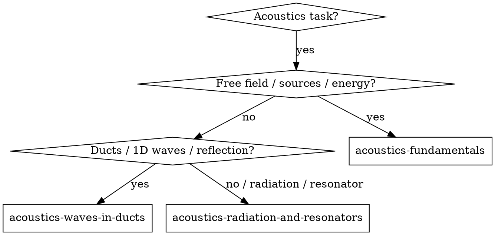
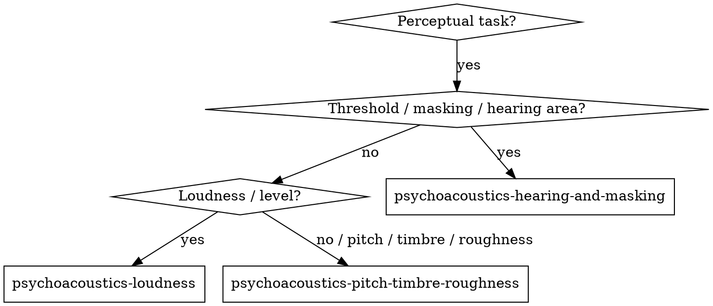

# Acoustics & Psychoacoustics Skills Family Implementation Plan

> **For agentic workers:** REQUIRED SUB-SKILL: Use superpowers:subagent-driven-development (recommended) or superpowers:executing-plans to implement this plan task-by-task. Steps use checkbox (`- [x]`) syntax for tracking.

**Goal:** Build and test two router skills and six focused sub-skills for acoustics and psychoacoustics, grounded in the Rienstra & Hirschberg and Zwicker & Fastl texts.

**Architecture:** Two router skills (`acoustics-problem-solving`, `psychoacoustics-problem-solving`) classify tasks and dispatch to focused sub-skills. Each focused skill is a self-contained `SKILL.md` with YAML frontmatter, a decision flowchart or routing rules, a core pattern, quick-reference tables, and red flags. Source skill files live in the project under `./skills/`.

**Tech Stack:** Markdown skill files; subagent pressure scenarios for validation; Rienstra and Zwicker markdown files as reference sources.

## Global Constraints
- All skill names use lowercase letters, numbers, and hyphens only.
- All skill descriptions start with "Use when..." and describe triggering conditions, not workflow.
- Each skill file stays under 600 words where possible.
- Skills must be self-contained; the full book markdowns are only for deep lookup.
- No skill is deployed until it passes its pressure scenarios.
- Router skills must list the exact sub-skill names they dispatch to.
- Sub-skills must reference the source book file path and chapter numbers.

---

### Task 1: Create directory structure

**Files:**
- Create: `skills/acoustics-problem-solving/`
- Create: `skills/acoustics-fundamentals/`
- Create: `skills/acoustics-waves-in-ducts/`
- Create: `skills/acoustics-radiation-and-resonators/`
- Create: `skills/psychoacoustics-problem-solving/`
- Create: `skills/psychoacoustics-hearing-and-masking/`
- Create: `skills/psychoacoustics-loudness/`
- Create: `skills/psychoacoustics-pitch-timbre-roughness/`

**Interfaces:**
- Produces: Eight empty skill source directories.

- [x] **Step 1: Create directories**

```bash
mkdir -p skills/acoustics-problem-solving \
  skills/acoustics-fundamentals \
  skills/acoustics-waves-in-ducts \
  skills/acoustics-radiation-and-resonators \
  skills/psychoacoustics-problem-solving \
  skills/psychoacoustics-hearing-and-masking \
  skills/psychoacoustics-loudness \
  skills/psychoacoustics-pitch-timbre-roughness
```

- [x] **Step 2: Verify directories exist**

```bash
ls -la skills/ | grep -E 'acoustics|psychoacoustics'
```

Expected: Eight directories listed.

- [x] **Step 3: Commit**

```bash
git add skills/
git commit -m "chore: scaffold acoustics and psychoacoustics skill source tree"
```

---

### Task 2: Implement `acoustics-problem-solving` router

**Files:**
- Create: `skills/acoustics-problem-solving/SKILL.md`

**Interfaces:**
- Produces: Router skill that dispatches to the three acoustics sub-skills.

- [x] **Step 1: Write the router skill**

Create `skills/acoustics-problem-solving/SKILL.md`:

```markdown
---
name: acoustics-problem-solving
description: Use when analyzing or implementing physical acoustics problems and need to choose the right acoustics sub-skill.
---

# Acoustics Problem Solving

## Overview
Classify the physical acoustics task by scale and phenomenon, then load the focused sub-skill that covers it.

## When to Use
- The task involves sound propagation, sources, reflection, radiation, or resonators.
- You need to choose between free-field fundamentals, duct/waveguide behavior, or radiation/resonator models.
- You are writing audio, room-acoustics, or transducer-related code.

## Decision Flowchart



## Routing Rules

1. If the problem is about free-field waves, speed of sound, acoustic energy, or sound sources → load `acoustics-fundamentals`.
2. If the problem is about pipes, ducts, plane waves, reflection/transmission, or 1D systems → load `acoustics-waves-in-ducts`.
3. If the problem is about radiation, resonators, Helmholtz resonators, or self-sustained oscillations → load `acoustics-radiation-and-resonators`.

## Available Sub-Skills

- `acoustics-fundamentals`
- `acoustics-waves-in-ducts`
- `acoustics-radiation-and-resonators`

## Common Mistakes
- Applying 1D duct formulas to free-field spherical radiation.
- Ignoring temperature dependence of the speed of sound.
- Treating a resonator as a simple mass-spring without checking radiation damping.
```

- [x] **Step 2: Verify frontmatter and file presence**

```bash
head -5 skills/acoustics-problem-solving/SKILL.md
ls -la skills/acoustics-problem-solving/SKILL.md
```

- [x] **Step 3: Commit**

```bash
git add skills/acoustics-problem-solving/SKILL.md
git commit -m "feat: add acoustics-problem-solving router skill"
```

---

### Task 3: Implement `acoustics-fundamentals`

**Files:**
- Create: `skills/acoustics-fundamentals/SKILL.md`

**Interfaces:**
- Consumes: Router dispatch from `acoustics-problem-solving`.
- Produces: Focused skill for free-field acoustics fundamentals.

- [x] **Step 1: Extract key reference content from Rienstra**

Search the source markdown for wave equation, speed of sound, and acoustic energy:

```bash
grep -n "wave equation" books/An_Introduction_to_Acoustics.md | head -10
grep -n "speed of sound" books/An_Introduction_to_Acoustics.md | head -10
```

- [x] **Step 2: Write the skill**

Create `skills/acoustics-fundamentals/SKILL.md`:

```markdown
---
name: acoustics-fundamentals
description: Use when solving free-field acoustics problems involving wave propagation, speed of sound, acoustic energy, or sound sources.
---

# Acoustics Fundamentals

## Overview
Model small-amplitude sound in fluids using the linearized wave equation and interpret energy, speed, and source terms.

## When to Use
- You need the speed of sound in air, water, or an ideal gas.
- You are setting up or verifying a wave equation simulation.
- You need acoustic intensity, energy density, or source power.

## Core Pattern

1. Verify linear acoustics applies: small perturbations, no shocks, compact region.
2. Write the wave equation for the medium:
   - Uniform stagnant fluid: ∇²p − (1/c²) ∂²p/∂t² = 0.
3. Pick the speed of sound c for the medium and conditions.
4. For sources, identify monopole (mass injection), dipole (momentum), or quadrupole (Lighthill) terms.
5. Compute acoustic energy density E = (1/2)ρ₀(u² + p²/(ρ₀²c²)) and intensity I = p u.

## Quick Reference

| Quantity | Formula | Typical value |
|----------|---------|---------------|
| Speed of sound in air (ideal gas) | c = √(γRT/M) | ~343 m/s at 20 °C |
| Speed of sound in water | c ≈ 1480 m/s | depends on temp/salinity |
| Plane wave impedance | Z = ρ₀c | ~415 Pa·s/m in air |
| Acoustic intensity | I = p²/(ρ₀c) = p u | W/m² |
| Sound pressure level | L_p = 20 log₁₀(p/p_ref), p_ref = 20 µPa | dB |

## Common Mistakes / Red Flags
- Using c = 340 m/s without noting temperature.
- Confusing acoustic pressure amplitude with total pressure.
- Applying plane-wave intensity formula to spherical waves without 1/r² correction.

## Rienstra Reference
- Chapter 1: Some fluid dynamics
- Chapter 2: Wave equation, speed of sound, and acoustic energy
- Source file: `/Volumes/home_ext1/src_pierre/all_of_sotf/books/An_Introduction_to_Acoustics.md`
```

- [x] **Step 3: Verify word count**

```bash
wc -w skills/acoustics-fundamentals/SKILL.md
```

Target: under 600 words.

- [x] **Step 4: Commit**

```bash
git add skills/acoustics-fundamentals/SKILL.md
git commit -m "feat: add acoustics-fundamentals sub-skill"
```

---

### Task 4: Implement `acoustics-waves-in-ducts`

**Files:**
- Create: `skills/acoustics-waves-in-ducts/SKILL.md`

**Interfaces:**
- Consumes: Router dispatch from `acoustics-problem-solving`.
- Produces: Focused skill for 1D and duct acoustics.

- [x] **Step 1: Extract key reference content from Rienstra**

Search the source markdown for plane waves, reflection, and duct modes:

```bash
grep -n "Plane waves" books/An_Introduction_to_Acoustics.md | head -10
grep -n "Reflection" books/An_Introduction_to_Acoustics.md | head -10
```

- [x] **Step 2: Write the skill**

Create `skills/acoustics-waves-in-ducts/SKILL.md`:

```markdown
---
name: acoustics-waves-in-ducts
description: Use when analyzing sound propagation in pipes, ducts, and one-dimensional waveguides, including reflection and transmission.
---

# Waves in Ducts

## Overview
Treat duct acoustics as 1D plane-wave propagation with reflection, transmission, and attenuation at boundaries and changes in cross-section.

## When to Use
- You are modeling pipes, ducts, horns, or vocal tracts.
- You need reflection/transmission coefficients at a junction.
- You need attenuation due to viscothermal boundary layers.

## Core Pattern

1. Assume plane waves if the wavelength is much larger than the duct cross-section.
2. Write forward and backward pressure waves: p(x,t) = A e^{j(ωt−kx)} + B e^{j(ωt+kx)}.
3. Apply boundary conditions (rigid wall, open end, impedance Z) to find A/B.
4. At a junction, enforce continuity of pressure and volume velocity.
5. Add thermoviscous attenuation for narrow ducts or long runs.

## Quick Reference

| Situation | Formula |
|-----------|---------|
| Plane wave | p = f(x − ct) + g(x + ct) |
| Reflection at rigid wall | R = 1 (pressure doubling at wall) |
| Reflection at open end | R ≈ −1 (low ka, unflanged) |
| Reflection coefficient from impedance | R = (Z − Z₀)/(Z + Z₀) |
| Transmission at area change | T = 2Z₂/(Z₁ + Z₂) (pressure) |
| Volume velocity | U = p S/(ρ₀c) for plane wave |

## Common Mistakes / Red Flags
- Using 3D spherical spreading formulas inside a duct.
- Assuming an open end is perfectly pressure-release without radiation correction.
- Ignoring higher-order duct modes at high frequency.

## Rienstra Reference
- Chapter 4: One dimensional acoustics
- Chapter 7: Duct acoustics
- Source file: `/Volumes/home_ext1/src_pierre/all_of_sotf/books/An_Introduction_to_Acoustics.md`
```

- [x] **Step 3: Verify word count**

```bash
wc -w skills/acoustics-waves-in-ducts/SKILL.md
```

Target: under 600 words.

- [x] **Step 4: Commit**

```bash
git add skills/acoustics-waves-in-ducts/SKILL.md
git commit -m "feat: add acoustics-waves-in-ducts sub-skill"
```

---

### Task 5: Implement `acoustics-radiation-and-resonators`

**Files:**
- Create: `skills/acoustics-radiation-and-resonators/SKILL.md`

**Interfaces:**
- Consumes: Router dispatch from `acoustics-problem-solving`.
- Produces: Focused skill for radiation and resonator acoustics.

- [x] **Step 1: Extract key reference content from Rienstra**

Search the source markdown for Green’s functions, resonators, and radiation:

```bash
grep -n "Helmholtz" books/An_Introduction_to_Acoustics.md | head -10
grep -n "Green" books/An_Introduction_to_Acoustics.md | head -10
```

- [x] **Step 2: Write the skill**

Create `skills/acoustics-radiation-and-resonators/SKILL.md`:

```markdown
---
name: acoustics-radiation-and-resonators
description: Use when analyzing sound radiation, resonators, or self-sustained oscillations.
---

# Radiation and Resonators

## Overview
Model radiation from compact sources and resonators using Green’s functions, impedance matching, and lumped-element approximations.

## When to Use
- You need radiation from a speaker, piston, or open pipe.
- You are designing a Helmholtz resonator or estimating its damping.
- You are analyzing whistles, flutes, or other self-sustained oscillations.

## Core Pattern

1. Identify the source as monopole, dipole, or quadrupole; far-field pressure scales with 1/r.
2. For a compact source, use p(r,t) ≈ (ρ₀/4πr) ∂Q/∂t.
3. For a resonator, split volume into neck (mass) and cavity (spring): f₀ = (c/2π)√(S/(V L_eff)).
4. Include radiation resistance and viscothermal losses in the total damping.
5. For self-sustained oscillations, match acoustic feedback to the hydrodynamic instability timing.

## Quick Reference

| Quantity | Formula |
|----------|---------|
| Monopole far-field pressure | p ≈ (jωρ₀Q)/(4πr) e^{−jkr} |
| Piston radiation impedance | Z_rad ≈ ρ₀c [ (ka)²/2 + j (8ka)/(3π) ] (ka << 1) |
| Helmholtz resonance | f₀ = (c/2π) √(S/(V L_eff)) |
| Effective neck length | L_eff ≈ L + 0.6a (unflanged) or L + 0.85a (flanged) |
| Quality factor | Q = 2π f₀ E / P_diss |

## Common Mistakes / Red Flags
- Forgetting the radiation mass correction to neck length.
- Ignoring damping and predicting an infinitely sharp resonance.
- Using a simple monopole model for a dipole-like source.

## Rienstra Reference
- Chapter 3: Green’s functions, impedance, and evanescent waves
- Chapter 5: Resonators and self-sustained oscillations
- Chapter 6: Spherical waves and radiation
- Source file: `/Volumes/home_ext1/src_pierre/all_of_sotf/books/An_Introduction_to_Acoustics.md`
```

- [x] **Step 3: Verify word count**

```bash
wc -w skills/acoustics-radiation-and-resonators/SKILL.md
```

Target: under 600 words.

- [x] **Step 4: Commit**

```bash
git add skills/acoustics-radiation-and-resonators/SKILL.md
git commit -m "feat: add acoustics-radiation-and-resonators sub-skill"
```

---

### Task 6: Implement `psychoacoustics-problem-solving` router

**Files:**
- Create: `skills/psychoacoustics-problem-solving/SKILL.md`

**Interfaces:**
- Produces: Router skill that dispatches to the three psychoacoustics sub-skills.

- [x] **Step 1: Write the router skill**

Create `skills/psychoacoustics-problem-solving/SKILL.md`:

```markdown
---
name: psychoacoustics-problem-solving
description: Use when analyzing or implementing human auditory perception problems and need to choose the right psychoacoustics sub-skill.
---

# Psychoacoustics Problem Solving

## Overview
Classify the perceptual task by the auditory attribute involved, then load the focused sub-skill that covers it.

## When to Use
- The task involves how humans hear loudness, pitch, timbre, masking, or roughness.
- You need to choose a perceptual model for an audio product or DSP algorithm.
- You are interpreting thresholds, masking curves, or loudness meter outputs.

## Decision Flowchart



## Routing Rules

1. If the task involves hearing thresholds, masking, tuning curves, or peripheral processing → load `psychoacoustics-hearing-and-masking`.
2. If the task involves loudness, partial masking, or loudness meters → load `psychoacoustics-loudness`.
3. If the task involves pitch, timbre, sharpness, roughness, fluctuation strength, or subjective duration → load `psychoacoustics-pitch-timbre-roughness`.

## Available Sub-Skills

- `psychoacoustics-hearing-and-masking`
- `psychoacoustics-loudness`
- `psychoacoustics-pitch-timbre-roughness`

## Common Mistakes
- Estimating loudness from SPL alone without frequency weighting.
- Confusing partial masking with complete inaudibility.
- Using linear frequency scales for perceptual pitch or critical-band problems.
```

- [x] **Step 2: Verify frontmatter and file presence**

```bash
head -5 skills/psychoacoustics-problem-solving/SKILL.md
ls -la skills/psychoacoustics-problem-solving/SKILL.md
```

- [x] **Step 3: Commit**

```bash
git add skills/psychoacoustics-problem-solving/SKILL.md
git commit -m "feat: add psychoacoustics-problem-solving router skill"
```

---

### Task 7: Implement `psychoacoustics-hearing-and-masking`

**Files:**
- Create: `skills/psychoacoustics-hearing-and-masking/SKILL.md`

**Interfaces:**
- Consumes: Router dispatch from `psychoacoustics-problem-solving`.
- Produces: Focused skill for hearing area and masking.

- [x] **Step 1: Extract key reference content from Zwicker**

Search the source markdown for threshold in quiet, masking, and critical bands:

```bash
grep -n "Threshold in Quiet" books/Psycho_Acoustics-Zwicker_Fastl.md | head -10
grep -n "Masking" books/Psycho_Acoustics-Zwicker_Fastl.md | head -10
```

- [x] **Step 2: Write the skill**

Create `skills/psychoacoustics-hearing-and-masking/SKILL.md`:

```markdown
---
name: psychoacoustics-hearing-and-masking
description: Use when analyzing hearing thresholds, masking effects, or peripheral auditory processing.
---

# Hearing and Masking

## Overview
Predict audibility and masking using the hearing area, critical bands, and psychoacoustical tuning curves.

## When to Use
- You need the threshold in quiet for a frequency.
- You need to predict whether a tone is masked by noise or another tone.
- You are designing a masking model or audio codec psychoacoustic model.

## Core Pattern

1. Identify the signal level and frequency of the target and masker.
2. Convert frequencies to critical-band rate (Bark scale): z = 13 arctan(0.00076 f) + 3.5 arctan((f/7500)²).
3. Determine the masked threshold from the masker level and the excitation pattern.
4. Check if the target level exceeds the masked threshold; if not, it is inaudible.
5. Account for temporal effects: premasking, postmasking, and overshoot.

## Quick Reference

| Quantity | Formula / Rule |
|----------|----------------|
| Hearing range | 20 Hz – 20 kHz; threshold varies with frequency |
| Bark scale | z = 13 arctan(0.00076 f) + 3.5 arctan((f/7500)²) |
| Critical bandwidth | ≈ 100 Hz below 500 Hz; ≈ 0.2f above 500 Hz |
| Simultaneous masking | Masker raises threshold in nearby critical bands |
| Temporal masking | Premasking ~5 ms; postmasking ~100–200 ms |

## Common Mistakes / Red Flags
- Using a fixed dB threshold independent of frequency.
- Ignoring the upward spread of masking.
- Confusing excitation level with sound pressure level.

## Zwicker Reference
- Chapter 1: Stimuli and procedures
- Chapter 2: Hearing area
- Chapter 3: Information processing in the auditory system
- Chapter 4: Masking
- Source file: `/Volumes/home_ext1/src_pierre/all_of_sotf/books/Psycho_Acoustics-Zwicker_Fastl.md`
```

- [x] **Step 3: Verify word count**

```bash
wc -w skills/psychoacoustics-hearing-and-masking/SKILL.md
```

Target: under 600 words.

- [x] **Step 4: Commit**

```bash
git add skills/psychoacoustics-hearing-and-masking/SKILL.md
git commit -m "feat: add psychoacoustics-hearing-and-masking sub-skill"
```

---

### Task 8: Implement `psychoacoustics-loudness`

**Files:**
- Create: `skills/psychoacoustics-loudness/SKILL.md`

**Interfaces:**
- Consumes: Router dispatch from `psychoacoustics-problem-solving`.
- Produces: Focused skill for loudness models.

- [x] **Step 1: Extract key reference content from Zwicker**

Search the source markdown for loudness and specific loudness:

```bash
grep -n "Loudness" books/Psycho_Acoustics-Zwicker_Fastl.md | head -10
```

- [x] **Step 2: Write the skill**

Create `skills/psychoacoustics-loudness/SKILL.md`:

```markdown
---
name: psychoacoustics-loudness
description: Use when calculating or estimating loudness, loudness level, or designing loudness meters.
---

# Loudness

## Overview
Estimate the perceived loudness of a sound by converting level and spectrum into specific loudness across critical bands and summing.

## When to Use
- You need a loudness estimate for a sound or audio file.
- You are implementing a loudness meter (e.g., ISO 532-1 / Zwicker model).
- You need to compare loudness of sounds with different spectra.

## Core Pattern

1. Measure or compute the 1/3-octave or FFT-based sound pressure level per critical band.
2. Convert each band level to specific loudness N' (sone/Bark), accounting for threshold in quiet.
3. Sum specific loudness over all audible Bark bands: N = Σ N' Δz.
4. For time-varying sounds, apply temporal integration (attack/release time constants).
5. Convert to loudness level in phon if needed: equal-loudness contours at 1 kHz.

## Quick Reference

| Quantity | Unit | Note |
|----------|------|------|
| Loudness | sone | Perceived magnitude; doubles every ~10 phon |
| Loudness level | phon | Matched level of a 1 kHz tone |
| Specific loudness | sone/Bark | Loudness density per critical band |
| 1 sone | 40 phon at 1 kHz | Reference point |
| Doubling loudness | +10 phon | Approximate rule of thumb |

## Common Mistakes / Red Flags
- Using A-weighted SPL as a proxy for loudness.
- Ignoring spectral distribution and critical bands.
- Forgetting temporal integration for time-varying signals.

## Zwicker Reference
- Chapter 8: Loudness
- Source file: `/Volumes/home_ext1/src_pierre/all_of_sotf/books/Psycho_Acoustics-Zwicker_Fastl.md`
```

- [x] **Step 3: Verify word count**

```bash
wc -w skills/psychoacoustics-loudness/SKILL.md
```

Target: under 600 words.

- [x] **Step 4: Commit**

```bash
git add skills/psychoacoustics-loudness/SKILL.md
git commit -m "feat: add psychoacoustics-loudness sub-skill"
```

---

### Task 9: Implement `psychoacoustics-pitch-timbre-roughness`

**Files:**
- Create: `skills/psychoacoustics-pitch-timbre-roughness/SKILL.md`

**Interfaces:**
- Consumes: Router dispatch from `psychoacoustics-problem-solving`.
- Produces: Focused skill for pitch, timbre, and related sensations.

- [x] **Step 1: Extract key reference content from Zwicker**

Search the source markdown for pitch, roughness, fluctuation, and sharpness:

```bash
grep -n "Pitch" books/Psycho_Acoustics-Zwicker_Fastl.md | head -10
grep -n "Roughness" books/Psycho_Acoustics-Zwicker_Fastl.md | head -10
```

- [x] **Step 2: Write the skill**

Create `skills/psychoacoustics-pitch-timbre-roughness/SKILL.md`:

```markdown
---
name: psychoacoustics-pitch-timbre-roughness
description: Use when analyzing pitch, timbre, roughness, fluctuation strength, sharpness, or subjective duration.
---

# Pitch, Timbre, and Roughness

## Overview
Map spectral and temporal signal properties to the corresponding perceptual attributes: pitch, timbre, roughness, fluctuation, sharpness, and subjective duration.

## When to Use
- You need to estimate pitch or pitch salience of a tone or complex sound.
- You are analyzing timbre, dissonance, or sensory pleasantness.
- You need roughness, fluctuation strength, or sharpness metrics.

## Core Pattern

1. Identify the attribute:
   - Pitch → spectral periodicity or fundamental frequency.
   - Timbre → spectral envelope and temporal envelope (everything besides pitch/loudness).
   - Roughness → rapid amplitude or frequency modulation (~20–200 Hz).
   - Fluctuation strength → slower modulation (~0.5–20 Hz).
   - Sharpness → high-frequency energy concentration.
2. Choose the appropriate model (e.g., virtual pitch, Terhardt model; roughness model; DIN 45692 sharpness).
3. Compute the feature from the excitation pattern or spectrogram.
4. Report units where defined (e.g., vacil for fluctuation, asper for roughness, acum for sharpness).

## Quick Reference

| Attribute | Typical model / cue | Unit |
|-----------|---------------------|------|
| Pure tone pitch | Matches fundamental frequency | mel / Hz |
| Virtual pitch | Terhardt / autocorrelation of resolved harmonics | Hz |
| Roughness | Modulation depth × frequency separation | asper |
| Fluctuation strength | Slow modulation depth and frequency | vacil |
| Sharpness | Weighted centroid of specific loudness | acum |
| Subjective duration | Temporal integration ~100–200 ms | — |

## Common Mistakes / Red Flags
- Estimating pitch from spectral peak alone for missing-fundamental sounds.
- Confusing roughness (fast modulation) with fluctuation strength (slow modulation).
- Treating timbre as a single number; it is multidimensional.

## Zwicker Reference
- Chapter 5: Pitch and pitch strength
- Chapter 9: Sharpness and sensory pleasantness
- Chapter 10: Fluctuation strength
- Chapter 11: Roughness
- Chapter 12: Subjective duration
- Source file: `/Volumes/home_ext1/src_pierre/all_of_sotf/books/Psycho_Acoustics-Zwicker_Fastl.md`
```

- [x] **Step 3: Verify word count**

```bash
wc -w skills/psychoacoustics-pitch-timbre-roughness/SKILL.md
```

Target: under 600 words.

- [x] **Step 4: Commit**

```bash
git add skills/psychoacoustics-pitch-timbre-roughness/SKILL.md
git commit -m "feat: add psychoacoustics-pitch-timbre-roughness sub-skill"
```

---

### Task 10: Verify `acoustics-problem-solving` routing

**Files:**
- Read: `skills/acoustics-problem-solving/SKILL.md`
- Create: `skills/acoustics-problem-solving/scenarios.md`

**Interfaces:**
- Consumes: All three acoustics sub-skills.
- Produces: Verified router with documented pressure scenarios.

- [x] **Step 1: Write pressure scenarios**

Create `skills/acoustics-problem-solving/scenarios.md`:

```markdown
# Acoustics Router Pressure Scenarios

## Scenario A: Speed of sound in a warm room
**Prompt:** "I need the speed of sound at 30 °C to set up a delay line in a room acoustics plugin."
**Expected:** Agent loads `acoustics-fundamentals` and computes c ≈ 349 m/s.

## Scenario B: Reflection in a duct
**Prompt:** "A 1 kHz plane wave hits a closed end in a pipe. What is the pressure reflection coefficient?"
**Expected:** Agent loads `acoustics-waves-in-ducts` and states R = +1.

## Scenario C: Helmholtz resonator tuning
**Prompt:** "Design a Helmholtz resonator to absorb 200 Hz in a small control room."
**Expected:** Agent loads `acoustics-radiation-and-resonators` and gives the f₀ formula.
```

- [x] **Step 2: Run each scenario through a subagent with the router skill loaded**

Use `Agent` with `subagent_type: "coder"` and a system prompt that includes the router skill content. The subagent should state which sub-skill it loads and why.

- [x] **Step 3: Record compliance or failures**

Append observations to `skills/acoustics-problem-solving/scenarios.md` under each scenario.

- [x] **Step 4: Patch and re-test if needed**

Edit `skills/acoustics-problem-solving/SKILL.md` and repeat Step 2 until compliant.

- [x] **Step 5: Commit**

```bash
git add skills/acoustics-problem-solving/
git commit -m "test: verify acoustics-problem-solving routing"
```

---

### Task 11: Verify `psychoacoustics-problem-solving` routing

**Files:**
- Read: `skills/psychoacoustics-problem-solving/SKILL.md`
- Create: `skills/psychoacoustics-problem-solving/scenarios.md`

**Interfaces:**
- Consumes: All three psychoacoustics sub-skills.
- Produces: Verified router with documented pressure scenarios.

- [x] **Step 1: Write pressure scenarios**

Create `skills/psychoacoustics-problem-solving/scenarios.md`:

```markdown
# Psychoacoustics Router Pressure Scenarios

## Scenario A: Masking in a codec
**Prompt:** "A 1 kHz tone at 50 dB SPL is masked by broadband noise at 60 dB SPL. Is it audible?"
**Expected:** Agent loads `psychoacoustics-hearing-and-masking`.

## Scenario B: Loudness meter
**Prompt:** "I need to implement a loudness meter for streaming audio. Which model should I use?"
**Expected:** Agent loads `psychoacoustics-loudness` and mentions Zwicker/ISO 532-1.

## Scenario C: Roughness estimation
**Prompt:** "How do I estimate the roughness of an amplitude-modulated tone for a timbre analysis tool?"
**Expected:** Agent loads `psychoacoustics-pitch-timbre-roughness`.
```

- [x] **Step 2: Run each scenario through a subagent with the router skill loaded**

Use `Agent` with `subagent_type: "coder"` and a system prompt that includes the router skill content.

- [x] **Step 3: Record compliance or failures**

Append observations to `skills/psychoacoustics-problem-solving/scenarios.md`.

- [x] **Step 4: Patch and re-test if needed**

Edit `skills/psychoacoustics-problem-solving/SKILL.md` and repeat Step 2 until compliant.

- [x] **Step 5: Commit**

```bash
git add skills/psychoacoustics-problem-solving/
git commit -m "test: verify psychoacoustics-problem-solving routing"
```

---

### Task 12: Spot-check focused skills with pressure scenarios

**Files:**
- Read: Each focused `SKILL.md`
- Create: `skills/<skill-name>/scenarios.md` for each focused skill

**Interfaces:**
- Consumes: Each focused skill content.
- Produces: At least one documented and verified scenario per focused skill.

- [x] **Step 1: Write one scenario per focused skill**

For each skill, create a `scenarios.md` with one concise scenario that the skill should answer correctly:

- `skills/acoustics-fundamentals/scenarios.md`
- `skills/acoustics-waves-in-ducts/scenarios.md`
- `skills/acoustics-radiation-and-resonators/scenarios.md`
- `skills/psychoacoustics-hearing-and-masking/scenarios.md`
- `skills/psychoacoustics-loudness/scenarios.md`
- `skills/psychoacoustics-pitch-timbre-roughness/scenarios.md`

Example format:

```markdown
# <Skill> Pressure Scenarios

## Scenario A
**Prompt:** "..."
**Expected with skill:** "..."
```

- [x] **Step 2: Run each scenario through a subagent with the skill loaded**

Use `Agent` with `subagent_type: "coder"` and a system prompt that includes the focused skill content.

- [x] **Step 3: Record compliance or failures**

Append observations to each `scenarios.md`.

- [x] **Step 4: Patch and re-test if needed**

Edit the relevant `SKILL.md` and repeat Step 2 until compliant.

- [x] **Step 5: Commit**

```bash
git add skills/
git commit -m "test: add and verify focused skill pressure scenarios"
```

---

### Task 13: Deploy skills to personal skills directory

**Files:**
- Read: All eight `SKILL.md` files

**Interfaces:**
- Consumes: All verified skill files.
- Produces: Deployed skills in `~/.agents/skills/`.

- [x] **Step 1: Copy skill files to runtime location**

```bash
for skill in acoustics-problem-solving acoustics-fundamentals acoustics-waves-in-ducts acoustics-radiation-and-resonators psychoacoustics-problem-solving psychoacoustics-hearing-and-masking psychoacoustics-loudness psychoacoustics-pitch-timbre-roughness; do
  mkdir -p "$HOME/.agents/skills/$skill"
  cp "skills/$skill/SKILL.md" "$HOME/.agents/skills/$skill/SKILL.md"
done
```

- [x] **Step 2: Verify deployment**

```bash
ls -la "$HOME/.agents/skills/" | grep -E 'acoustics|psychoacoustics'
head -5 "$HOME/.agents/skills/acoustics-problem-solving/SKILL.md"
```

Expected: Eight skill directories and valid YAML frontmatter.

- [x] **Step 3: Commit project source files**

```bash
git add skills/ docs/superpowers/plans/2026-07-10-acoustics-psychoacoustics-skills.md
git commit -m "deploy: acoustics and psychoacoustics skill family"
```

---

## Self-Review Checklist

- [x] Spec coverage: two routers + six sub-skills + TDD-for-skills testing are all represented.
- [x] Placeholder scan: no TBD, TODO, or "implement later".
- [x] Type consistency: skill names and sub-skill references match across files.
- [x] File paths are exact and use project-local `skills/` source tree.
- [x] Each task ends with a testable deliverable and a commit.
