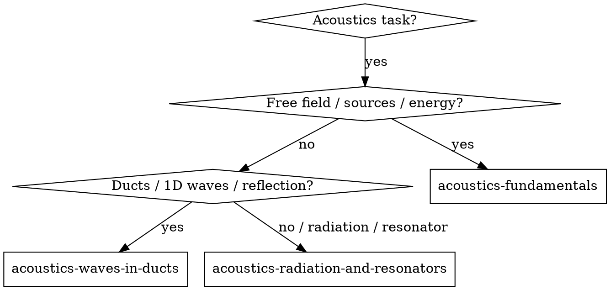

# Acoustics Problem Solving

## Overview
Classify the physical acoustics task by scale and phenomenon, then load the focused sub-skill that covers it.

## When to Use
- The task involves sound propagation, sources, reflection, radiation, or resonators.
- You need to choose between free-field fundamentals, duct/waveguide behavior, or radiation/resonator models.
- You are writing audio, room-acoustics, or transducer-related code.

## Decision Flowchart

## Routing Rules

1. If the problem is about free-field waves, speed of sound, acoustic energy, or sound sources → load `acoustics-fundamentals`.
2. If the problem is about pipes, ducts, plane waves, reflection/transmission, or 1D systems → load `acoustics-waves-in-ducts`.
3. If the problem is about radiation, resonators, Helmholtz resonators, or self-sustained oscillations → load `acoustics-radiation-and-resonators`.
4. If the problem mixes scales or is unclear, start with `acoustics-fundamentals`.

## Implemented Sub-Skills

- `acoustics-fundamentals`
- `acoustics-waves-in-ducts`
- `acoustics-radiation-and-resonators`

## Common Mistakes
- Applying 1D duct formulas to free-field spherical radiation.
- Ignoring temperature dependence of the speed of sound.
- Treating a resonator as a simple mass-spring without checking radiation damping.
