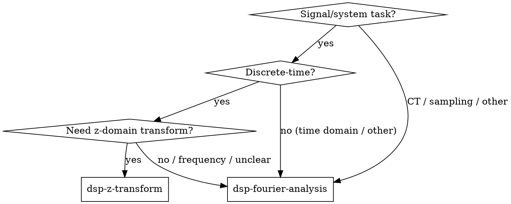

# DSP Problem Solving

## Overview
Classify the signal/system task and load the focused sub-skill that teaches the right technique.

## When to Use
- The task involves continuous-time or discrete-time signals or LTI systems.
- You need to choose between time-domain, Fourier, Laplace, or z-domain analysis.
- You are reviewing or writing DSP code and want to avoid transform misuse.

## Decision Flowchart

## Routing Rules

1. If the system/signal is discrete-time and you need the z-transform (difference equation, H(z), ROC, stability) → load `dsp-z-transform`.
2. For all other signal/system tasks — including continuous-time transforms, Fourier analysis, sampling, Laplace, time-domain-only analysis, or unclear/mixed CT-DT problems — load `dsp-fourier-analysis`.

## Available Sub-Skills (This Cycle)

The following sub-skills are implemented and ready to load:
- `dsp-fourier-analysis`
- `dsp-z-transform`

The following sub-skills are planned for future cycles:
- `dsp-continuous-time-lti`
- `dsp-discrete-time-lti`
- `dsp-laplace-transform`
- `dsp-sampling`

## Common Mistakes
- Picking Laplace for a discrete-time problem or z-transform for a continuous-time problem.
- Skipping the region of convergence / stability check.
- Trying to solve a sampling problem entirely in one domain without checking the Nyquist condition.
