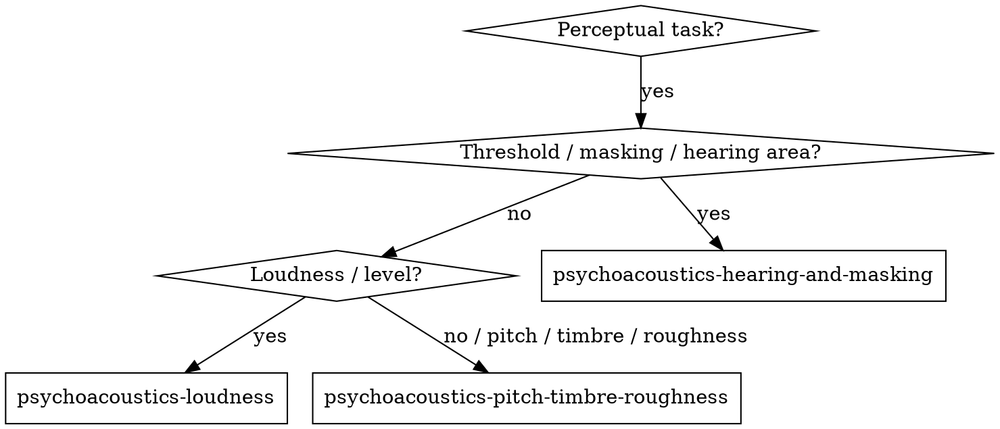

# Psychoacoustics Problem Solving

## Overview
Classify the perceptual task by the auditory attribute involved, then load the focused sub-skill that covers it.

## When to Use
- The task involves how humans hear loudness, pitch, timbre, masking, or roughness.
- You need to choose a perceptual model for an audio product or DSP algorithm.
- You are interpreting thresholds, masking curves, or loudness meter outputs.

## Decision Flowchart

## Routing Rules

1. If the task involves hearing thresholds, masking, tuning curves, or peripheral processing → load `psychoacoustics-hearing-and-masking`.
2. If the task involves loudness, partial masking, or loudness meters → load `psychoacoustics-loudness`.
3. If the task involves pitch, timbre, sharpness, roughness, fluctuation strength, or subjective duration → load `psychoacoustics-pitch-timbre-roughness`.
4. If the perceptual task is mixed or unclear, start with `psychoacoustics-hearing-and-masking`.

## Implemented Sub-Skills

- `psychoacoustics-hearing-and-masking`
- `psychoacoustics-loudness`
- `psychoacoustics-pitch-timbre-roughness`

## Common Mistakes
- Estimating loudness from SPL alone without frequency weighting.
- Confusing partial masking with complete inaudibility.
- Using linear frequency scales for perceptual pitch or critical-band problems.
